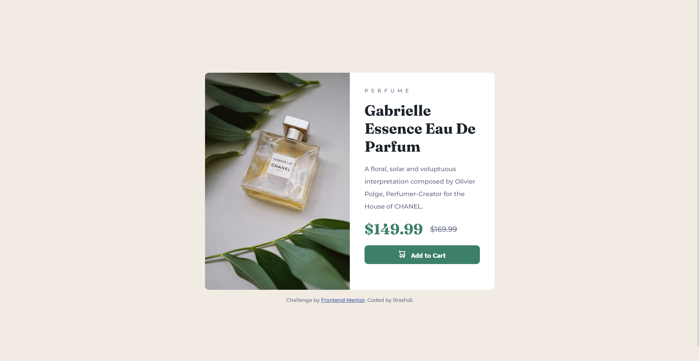

# Frontend Mentor - Product preview card component solution

This is a solution to the [Product preview card component challenge on Frontend Mentor](https://www.frontendmentor.io/challenges/product-preview-card-component-GO7UmttRfa). Frontend Mentor challenges help you improve your coding skills by building realistic projects. 

## Table of contents

- [Overview](#overview)
  
  - [Screenshot](#screenshot)
  - [Links](#links)
- [My process](#my-process)
  - [Built with](#built-with)
  - [What I learned](#what-i-learned)


## Overview

### Screenshot

- 
- 

### Links

- Solution URL: [Add solution URL here](https://your-solution-url.com)
- Live Site URL: [Add live site URL here](https://your-live-site-url.com)

## My process

### Built with

- Semantic HTML5 markup
- CSS custom properties
- Flexbox
- CSS Grid
- Mobile-first workflow


### What I learned

- Always start with mobile first.
- If alternative images used in same place but in different media, wrap images in - <picture></picture> - tag and
  use <source> tag for each image will be used.
  ```html
  <picture>
    <source src='image-1'>
    <source src='image-2'>
  </picture>
  ```
- Within the <source> tag, many important attributes such as (media) attribute, which acts as @media in css.
  ```html
  <source srcset='an image' media='min-width: 600px'>
  ```
  media attribute is equevilent in css:-
  ```CSS
  @media(min-width: 600px)
  ```
